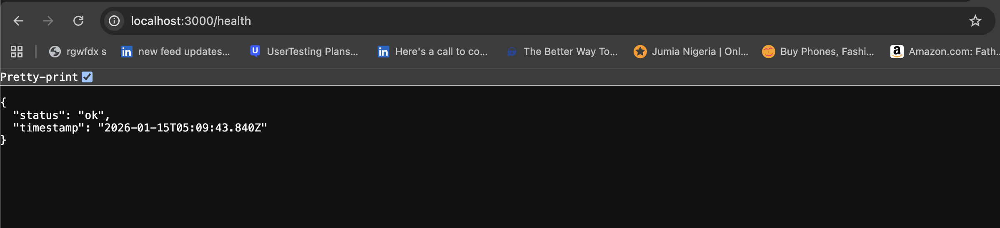
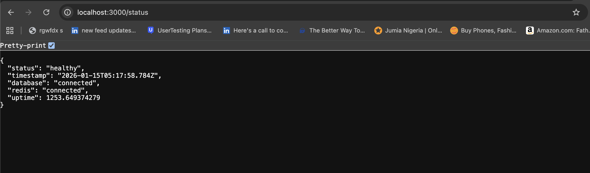
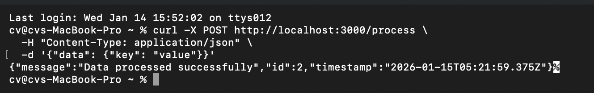

# CredPal - Production-Ready Node.js Application with DevOps Pipeline

A complete, enterprise-grade Node.js application with full containerization, CI/CD automation, Infrastructure as Code (Terraform), and comprehensive security & observability.

## 📋 Table of Contents

- [Quick Start](#quick-start)
- [Project Structure](#project-structure)
- [API Endpoints](#api-endpoints)
- [Local Development](#local-development)
- [Docker & Containerization](#docker--containerization)
- [Deployment](#deployment)
- [Infrastructure](#infrastructure)
- [CI/CD Pipeline](#cicd-pipeline)
- [Security](#security)
- [Observability & Monitoring](#observability--monitoring)
- [Troubleshooting](#troubleshooting)
- [Architecture Decisions](#architecture-decisions)

## 🚀 Quick Start

### Prerequisites

- Docker & Docker Compose 20.10+
- Node.js 20+ (for local development)
- Git
- AWS CLI (for production deployment)
- Terraform 1.0+ (for infrastructure)

### Local Development

```bash
# Clone the repository
git clone https://github.com/your-org/credpal-node-app.git
cd credpal-node-app

# Copy environment file
cp .env.example .env

# Install dependencies
npm install

# Start with Docker Compose
docker-compose up

# Or run locally (requires PostgreSQL + Redis running)
npm start
```

### Access the Application

- **Health Check**: http://localhost:3000/health
- **Status**: http://localhost:3000/status
- **Process Data**: POST to http://localhost:3000/process

## 📁 Project Structure

```
credpal-node-app/
├── src/
│   ├── app.js              # Main application
│   ├── app.test.js         # Unit tests
│   └── metrics.js          # Metrics collection
├── db/
│   └── init.sql            # Database initialization
├── terraform/
│   ├── main.tf             # Terraform configuration
│   ├── vpc.tf              # VPC & networking
│   ├── security_groups.tf  # Security groups
│   ├── load_balancer.tf    # ALB & auto-scaling
│   ├── database.tf         # RDS & ElastiCache
│   ├── route53.tf.tf       # DNS Configurations
│   ├── iam.tf              # IAM roles & policies
│   ├── variables.tf        # Variables
│   ├── outputs.tf          # Outputs
│   ├── providers.tf        # Provider config
│   └── ecs.tf              # ECS cluster bootstrap script
│   ├── ecr.tf              # ECR repo bootstrap script
├── .github/
│   └── workflows/
│       └── ci-cd.yml       # GitHub Actions pipeline
├── .aws/
│   └── task.json/.         # ecs tasks deffinition
├── scripts/
│   ├── blue-green-deploy.sh    # Blue-green deployment
│   └── rolling-deploy.sh       # Rolling deployment
├── docs/
│   ├── SECURITY.md         # Security guide
│   └── OBSERVABILITY.md    # Observability guide
├── Dockerfile              # Production Docker image
├── docker-compose.yml      # Local development
├── docker-compose.staging.yml  # Staging environment
├── package.json            # Dependencies
└── README.md               # This file
```

## 🔌 API Endpoints

### 1. Health Check
```bash
curl http://localhost:3000/health
```

**Response** (200 OK):
```json
{
  "status": "ok",
  "timestamp": "2026-01-15T05:09:43.840Z"
}
```


### 2. Status
```bash
curl http://localhost:3000/status
```

**Response** (200 OK):
```json
{
  "status": "healthy",
  "timestamp": "2026-01-15T05:17:58.784Z",
  "database": "connected",
  "redis": "connected",
  "uptime": 1253.649374279
}
```


### 3. Process Data
```
curl -X POST http://localhost:3000/process \
  -H "Content-Type: application/json" \
  -d '{"data": {"key": "value"}}'
{"message":"Data processed successfully","id":2,"timestamp":"2026-01-15T05:21:59.375Z"}% 
```


**Response** (200 OK):
```json
{"message":"Data processed successfully","id":2,"timestamp":"2026-01-15T05:21:59.375Z"}% 
```

## 💻 Local Development

### Setup

```bash
# Install dependencies
npm install

# Copy and configure environment
cp .env.example .env

# Start services with Docker Compose
docker-compose up -d

# Run migrations (optional)
docker-compose exec postgres psql -U postgres -d credpal -f /docker-entrypoint-initdb.d/init.sql

# Run application
npm start
```

### Available Commands

```bash
# Start application
npm start

# Development with auto-reload
npm run dev

# Run tests
npm test

# Run tests with coverage
npm test -- --coverage

# Watch tests
npm run test:watch
```

### Database Access

```bash
# Connect to PostgreSQL
docker-compose exec postgres psql -U postgres -d credpal

# Connect to Redis
docker-compose exec redis redis-cli

# View application logs
docker-compose logs -f app
```

## 🐳 Docker & Containerization

### Dockerfile Best Practices

✅ **Multi-stage builds**: Reduces final image size
✅ **Non-root user**: Runs as nodejs user (UID 1001)
✅ **Health checks**: Built-in HTTP health probe
✅ **Signal handling**: Uses dumb-init for proper signal forwarding
✅ **Minimal base image**: Alpine Linux (20MB vs 900MB)
✅ **Security scanning**: Trivy vulnerability scanning in CI/CD

### Build Docker Image

```bash
# Build locally
docker build -t credpal-node-app:latest .

# Build with buildx (multi-arch)
docker buildx build --platform linux/amd64,linux/arm64 \
  -t credpal-node-app:latest .
```

### Push to Registry

```bash
# GitHub Container Registry
docker tag credpal-node-app:latest ghcr.io/your-org/credpal-node-app:latest
docker push ghcr.io/your-org/credpal-node-app:latest

# Docker Hub
docker tag credpal-node-app:latest your-org/credpal-node-app:latest
docker push your-org/credpal-node-app:latest
```

### Docker Compose

```bash
# Start all services
docker-compose up -d

# View logs
docker-compose logs -f app

# Stop services
docker-compose down

# Staging environment
docker-compose -f docker-compose.staging.yml up -d
```

## 🚢 Deployment

### Production Deployment

#### Option 1: Blue-Green Deployment

```bash
# Requires: Docker running, latest image pulled, containers named credpal-app-blue/green

cd scripts
./blue-green-deploy.sh

# Features:
# - Zero downtime
# - Automatic rollback on failure
# - Health checks before switching traffic
# - Quick rollback to previous version
```

#### Option 2: Rolling Deployment

```bash
# Requires: AWS CLI, Terraform, ASG configured

export ASG_NAME=credpal-asg
export AWS_REGION=us-east-1

cd scripts
./rolling-deploy.sh

# Features:
# - Gradual instance replacement
# - Maintains min healthy instances
# - No downtime
# - Automatic recovery
```

#### Option 3: Terraform Deployment

```bash
cd terraform

# Initialize Terraform
terraform init

# Plan deployment
terraform plan -out=tfplan

# Apply configuration
terraform apply tfplan

# Outputs
terraform output app_url
terraform output load_balancer_dns
```

## 🏗️ Infrastructure

### Architecture

```
┌─────────────────────────────────────┐
│         Internet Users              │
└──────────────────┬──────────────────┘
                   │
        ┌──────────▼──────────┐
        │   Route 53 (DNS)    │
        └──────────┬──────────┘
                   │
        ┌──────────▼──────────────┐
        │  Application Load       │
        │  Balancer (ALB)         │
        │  (Port 80/443)          │
        └──────────┬──────────────┘
                   │
        ┌──────────▼──────────────────────┐
        │   Auto Scaling Group (ASG)      │
        │  Min: 2, Max: 4, Desired: 2     │
        │                                 │
        │  ┌──────────┐  ┌──────────┐     │
        │  │  ECS     │  │  ECS     │     │
        │  │ Service  │--│ Service  │     │
        │  │Port 3000 │  │Port 3000 │     │
        │  └────┬─────┘  └────┬─────┘     │
        └───────┼──────────────┼─────────┘
                │              │
        ┌───────▼──────┐  ┌────▼────────────┐
        │   RDS        │  │  ElastiCache    │
        │   PostgreSQL │  │   Redis         │
        │              │  │                 │
        │ Multi-AZ     │  │ Port 6379       │
        │ Encrypted    │  │ Encrypted       │
        └──────────────┘  └─────────────────┘
```

### Key Components

| Component | Details |
|-----------|---------|
| **VPC** | 10.0.0.0/16 with 2 AZs |
| **Public Subnets** | 10.0.1.0/24, 10.0.2.0/24 |
| **Private Subnets** | 10.0.10.0/24, 10.0.11.0/24 |
| **ALB** | Handles HTTP/HTTPS, redirects to HTTPS |
| **Auto Scaling** | CPU-based scaling, min:2, max:4 |
| **RDS** | PostgreSQL 16, multi-AZ, encrypted |
| **ElastiCache** | Redis 7, encryption enabled |
| **NAT Gateways** | For private subnet internet access |

### Terraform Commands

```bash
cd terraform

# Initialize
terraform init -backend-config="bucket=credpal-terraform-state"

# Validate
terraform validate

# Plan
terraform plan -out=tfplan

# Apply
terraform apply tfplan

# Destroy (CAREFUL!)
terraform destroy -auto-approve

# View state
terraform state list
terraform state show aws_lb.main

# Import existing resources
terraform import aws_vpc.main vpc-xxxxx
```

## 🔄 CI/CD Pipeline

### GitHub Actions Workflow

The pipeline runs on:
- Push to `main` branch
- Pull requests to `main` branch

### Pipeline Stages

1. **Test** (parallel)
   - Install dependencies
   - Run linter
   - Run tests with coverage
   - Upload coverage to Codecov

2. **Build & Push** (after test)
   - Set up Docker buildx
   - Build Docker image
   - Push to GitHub Container Registry
   - Cache layers for faster builds

3. **Security Scan** (parallel)
   - Trivy filesystem scan
   - Upload results to GitHub Security tab

4. **Deploy Staging** (after build)
   - Deploy to staging environment
   - Run smoke tests

5. **Deploy Production** (requires manual approval)
   - Manual approval step
   - Deploy to production

### Trigger Manually

```bash
# Via GitHub CLI
gh workflow run ci-cd.yml --ref main

# Via GitHub Web UI
Go to Actions > CI/CD Pipeline > Run workflow
```

### View Logs

```bash
# Via GitHub CLI
gh run list
gh run view <RUN_ID> --log

# Via GitHub Web UI
Go to Actions tab > select workflow > view logs
```

## 🔐 Security

### Key Security Features

✅ **Secrets Management**
- AWS Secrets Manager for database credentials
- No secrets in git or Docker images
- Automatic secret rotation

✅ **Network Security**
- VPC isolation with public/private subnets
- Security groups with least privilege
- NAT gateways for private subnet egress

✅ **Application Security**
- Helmet.js for HTTP headers
- Non-root container user
- Input validation
- Error handling without exposing internals

✅ **Data Security**
- RDS encryption at rest
- TLS/SSL in transit
- Database backups (30-day retention)
- Encrypted ElastiCache

✅ **Access Control**
- IAM roles (least privilege)
- No hardcoded credentials
- Secrets Manager for rotation

✅ **CI/CD Security**
- GitHub token for registry auth
- Trivy vulnerability scanning
- SARIF security reports

### Security Checklist

See [docs/SECURITY.md](docs/SECURITY.md) for detailed security guide.

## 📊 Observability & Monitoring

### Logging

- **Application**: Winston logger with JSON output
- **Container**: Docker logs, CloudWatch Logs
- **Infrastructure**: CloudWatch, CloudTrail

### Health Checks

- **Readiness**: `GET /health` (200 OK)
- **Liveness**: `GET /status` (checks DB + app)

### Metrics

- Custom metrics via `/metrics` endpoint
- CloudWatch metrics (CPU, network, disk)
- Request count, error rate, response times

### Alarms

- High CPU (> 70%) → Scale up
- Low CPU (< 30%) → Scale down
- Target unhealthy → Replace instance
- Database CPU high → Alert

### Dashboards

Create CloudWatch dashboard:
```bash
aws cloudwatch put-dashboard --dashboard-name CredPal \
  --dashboard-body file://dashboard.json
```

See [docs/OBSERVABILITY.md](docs/OBSERVABILITY.md) for detailed monitoring guide.

## 🔧 Troubleshooting

### Application Won't Start

```bash
# Check logs
docker-compose logs app

# Check environment variables
docker-compose exec app env

# Check database connectivity
docker-compose exec app npm test
```

### Database Connection Issues

```bash
# Check PostgreSQL status
docker-compose logs postgres

# Test connection
docker-compose exec postgres psql -U postgres -c "SELECT 1"

# Check network connectivity
docker network ls
docker network inspect credpal-network
```

### Docker Build Fails

```bash
# Clear cache and rebuild
docker-compose build --no-cache

# Check Dockerfile
docker build -t credpal:test . --progress=plain

# View build layers
docker history credpal:test
```

### Terraform Errors

```bash
# Validate configuration
terraform validate

# Format files
terraform fmt -recursive

# Check state
terraform state list

# Unlock state (if locked)
terraform force-unlock <LOCK_ID>
```

## 🏛️ Architecture Decisions

### 1. **Multi-stage Docker Build**
- **Why**: Reduce image size and attack surface
- **How**: Separate builder stage from runtime
- **Result**: ~150MB → ~50MB image size

### 2. **Non-root Container User**
- **Why**: Reduce privilege escalation risk
- **How**: Create dedicated `nodejs` user (UID 1001)
- **Result**: Limited damage if container compromised

### 3. **Auto Scaling with CloudWatch**
- **Why**: Automatic capacity management
- **How**: CPU-based scaling policies
- **Result**: Cost savings + reliability

### 4. **Blue-Green Deployment**
- **Why**: Zero-downtime updates
- **How**: Run two versions, switch traffic atomically
- **Result**: Instant rollback if issues

### 5. **RDS Multi-AZ**
- **Why**: High availability & durability
- **How**: Automatic failover to standby
- **Result**: 99.95% availability SLA

### 6. **Secrets Manager**
- **Why**: Secure credential management
- **How**: Centralized secrets, auto-rotation
- **Result**: No secrets in code/images

### 7. **Health Checks**
- **Why**: Automatic unhealthy instance detection
- **How**: HTTP health probes every 30s
- **Result**: Fast recovery (< 2 minutes)

### 8. **CloudWatch Monitoring**
- **Why**: Observability & alerting
- **How**: Centralized metrics & logs
- **Result**: Fast issue detection & resolution

## 📈 Performance Considerations

### Optimization Tips

1. **Database**: Use connection pooling (pg library)
2. **Caching**: Redis for session/data caching
3. **Load Balancing**: ALB with sticky sessions (optional)
4. **Compression**: Enable gzip in ALB
5. **CDN**: CloudFront for static assets
6. **Monitoring**: Track p95/p99 latencies

### Load Testing

```bash
# Using Apache Bench
ab -n 10000 -c 100 http://localhost:3000/health

# Using wrk
wrk -t12 -c400 -d30s http://localhost:3000/health

# Using k6
k6 run load-test.js
```

## 🚀 Scaling Considerations

### Horizontal Scaling
- Auto Scaling Group handles instance scaling
- Load Balancer distributes traffic
- Database: RDS read replicas (future)

### Vertical Scaling
- Change EC2 instance type (terraform)
- Change RDS instance class (terraform)
- Monitor resource utilization

## 📝 Contributing

1. Create feature branch: `git checkout -b feature/amazing-feature`
2. Commit changes: `git commit -m 'Add amazing feature'`
3. Push to branch: `git push origin feature/amazing-feature`
4. Open Pull Request
5. Wait for CI/CD to pass
6. Request review from team

## 📄 License

This project is licensed under the MIT License - see LICENSE file for details.

## 🤝 Support

For issues and questions:
- GitHub Issues: [Create an issue](https://github.com/your-org/credpal-node-app/issues)
- Documentation: See [docs/](docs/) folder
- Email: devops@your-org.com

## 📚 Additional Resources

- [Node.js Best Practices](https://github.com/goldbergyoni/nodebestpractices)
- [Docker Best Practices](https://docs.docker.com/develop/dev-best-practices/)
- [Terraform AWS Provider](https://registry.terraform.io/providers/hashicorp/aws/latest/docs)
- [AWS Well-Architected Framework](https://aws.amazon.com/architecture/well-architected/)
- [OWASP Application Security](https://owasp.org/)

---

**Last Updated**: January 15, 2026
**Version**: 1.0.0
